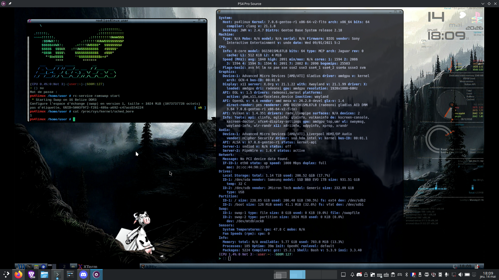

# Linux Kernel — Sony PlayStation 4

**Open source kernel tree for the Sony PlayStation 4 (Aeolia, Belize, Baikal).**

[Explore Branches](#stable-branches) • [Compatibility](#console-compatibility) • [Build Guide](#build) • [Contributing](#issues--contributing) • [Discord](https://discord.gg/fZQScGvRQb)

---

## Stable Branches

| Branch | Target | Notes |
|--------|--------|-------|
| [`aeolia-belize/7.0.8-Stable`](https://github.com/rmuxnet/ps4-linux-12xx/tree/aeolia-belize/7.0.8-Stable) | Aeolia / Belize | Current recommended branch |
| [`baikal/7.0.8-Stable`](https://github.com/rmuxnet/ps4-linux-12xx/tree/baikal/7.0.8-Stable) | Baikal | Active 7.0 bringup for Slim/Pro |
| [`6.18.21-Strawberry`](https://github.com/rmuxnet/ps4-linux-12xx/tree/6.18.21-Strawberry) | Aeolia / Belize | LTS fallback line |

For all branches see [BRANCHES.md](./BRANCHES.md).

---

## Console Compatibility

| Console Model | Variation | WiFi+BT Chip | Compatible Branches |
|---|---|---|---|
| CUH-1216(A/B) | Phat - Belize B0 | Marvell 88w8897 / Torus 2 | `aeolia-belize/7.0.8-Stable`, `6.18.21`, `5.15.15` |
| CUH-1215(A/B) | Phat - Belize | Marvell 88w8897 / Torus 2 | `aeolia-belize/7.0.8-Stable`, `6.18.21`, `5.15.15` |
| CUH-1003 | Phat - Aeolia | Marvell 88w8797 / Torus 1 | `aeolia-belize/7.0.8-Stable`, `6.18.21` |
| CUH-1004A | Phat - Aeolia | Marvell 88w8797 / Torus 1 | `aeolia-belize/7.0.8-Stable`, `6.18.21` |
| CUH-1116A | Phat - Aeolia | Marvell 88w8797 / Torus 1 | `aeolia-belize/7.0.8-Stable`, `6.18.21` |
| CUH-2215B | Slim - Baikal | MediaTek 7668 / Trooper | `baikal/7.0.8-Stable`, `5.4.247` |
| CUH-2216A | Slim - Baikal B1 | MediaTek 7668 / Trooper | `baikal/7.0.8-Stable`, `5.4.247` |
| CUH-2216A | Slim - Belize | MediaTek 7668 / Trooper | `aeolia-belize/7.0.8-Stable`, `6.18.21`, `5.15.15` |
| CUH-7116B | Pro - Baikal B1 | MediaTek 7668 / Trooper | `baikal/7.0.8-Stable`, `5.4.247` |
| CUH-7202B | Pro - Baikal | MediaTek 7668 / Trooper | `baikal/7.0.8-Stable`, `5.4.247` |

> A/B suffixes denote 500GB vs 1TB drive variants.

---

## Build

\`\`\`bash
git clone https://github.com/rmuxnet/ps4-linux-12xx --branch aeolia-belize/7.0.8-Stable --depth=3
cd ps4-linux-12xx

# SD8797 firmware required if config requests it:
# extra_firmware/mrvl/sd8797_uapsta.bin

./build.sh --option 3 use=General lto=ThinLTO
# or
./build.sh --option 3 use=Server lto=FullLTO
\`\`\`

**Profiles:** `General` — desktop/gaming. `Server` — headless, container stack enabled.

Output: `out/bzImage`, `out/.config`, `out/artifact_name.txt`.

---

## Builds

Latest pre-compiled kernels are available via [GitHub Actions](https://github.com/rmuxnet/ps4-linux-12xx/actions). Click the latest run, pick your branch, and grab the `bzImage` artifact. Read the run notes before booting.

---

## Attribution and Provenance

This kernel tree was upstreamed and maintained by **Dievas** (7xkq / rmux) from 6.15 through 6.17, 6.18, 6.19, and 7.0. The Baikal port was brought forward from whitehax0r's 5.4 tree onto the working 7.0 base over six days and ~120 builds, tested entirely over UART without owning Baikal hardware. The full commit history is public and traceable.

### Uncredited Redistribution

In April–May 2026, **saya and the KHEOPS group** cloned this tree, stripped all attribution, and released it as their own. No fork, no credit, no source link. They then publicly accused the original author of stealing.

The evidence is straightforward:

- This is the only public PS4 Linux kernel that went from 6.15 → 6.17 → 6.18 → 6.19 → 7.0. The full commit history is here.
- A recent screenshot from saya's team shows `sensors` output with fan speed readout — hwmon fan reporting that only exists in this kernel:

  

- saya publicly stated: *"I don't use kernel 'strawberry', I use my bzImages released."* — bzImages built from this tree with credits removed.
- saya later claimed to be "on 7.0.4, approaching 7.0.6" internally, done "out of passion, not for glory." There is no other public 7.0 PS4 kernel tree to base that on. The only source is this one.

Calling someone's work garbage and then shipping it under your name isn't development. It's a file rename with an ego.

If you build on this work, credit it. That's the bare minimum.

---

## Credits

**Original 5.4 Baikal Bringup:**
whitehax0r — [ps4-linux-baikal](https://github.com/whitehax0r/ps4-linux-baikal). The tree that opened the door.

**Community Boost:**
[Logic-Sunrise](https://www.logic-sunrise.com/forums/topic/108827-ps4-des-avancees-majeures-sur-le-kernel-linux-70-de-la-ps4-baikal/) — coverage that brought in the testers who made the Baikal sprint possible.

**Core 7.0 Baikal Contributors:**
- **Blyadimir** — UART, USB, display, endless testing. This wouldn't exist without him.
- **deWaardt** — Baikal hardware maintainer, early tests.
- **leg** (eclipsed.starr) — bzImage uploads, coordination.
- **Package** (packagebob) — original 6.15 Aeolia/Belize source, parallel 6.15 Baikal work.

**Baikal Testers:**
kingabut, shyxuo, ss6530, izanhower, sgtxkitkat, vanix, mechanical, rodrigo, sudofrontman

**Additional Testers:**
Wonderfiend, Razzle, Bbang, Gryoza, fleur, froyo, Anghelo, TheGreekOne, felix_suicide, GMV, tteons, Scrooge

**Maintainer:**
**Dievas** (7xkq / rmux) — kernel upstreaming from 6.15, Baikal migration to 7.0, Strawberry maintainer.

---

## Why Strawberry Exists

Millions of PS4s are heading for the trash. Every one is an 8-core x86 machine with 8GB of RAM. Strawberry exists to keep them alive and useful.

Steady, open, credited work from 6.15 to 7.0. Not a rushed Discord dump. Not a renamed clone. 🍓

---

## Issues / Contributing

- [Issues](https://github.com/rmuxnet/ps4-linux-12xx/issues)
- [Discussions](https://github.com/rmuxnet/ps4-linux-12xx/discussions)

Include: console model, southbridge, branch + commit, `dmesg`, and which subsystems work or don't.

---

### Stargazers over time

